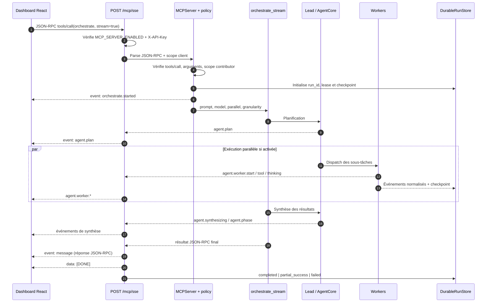
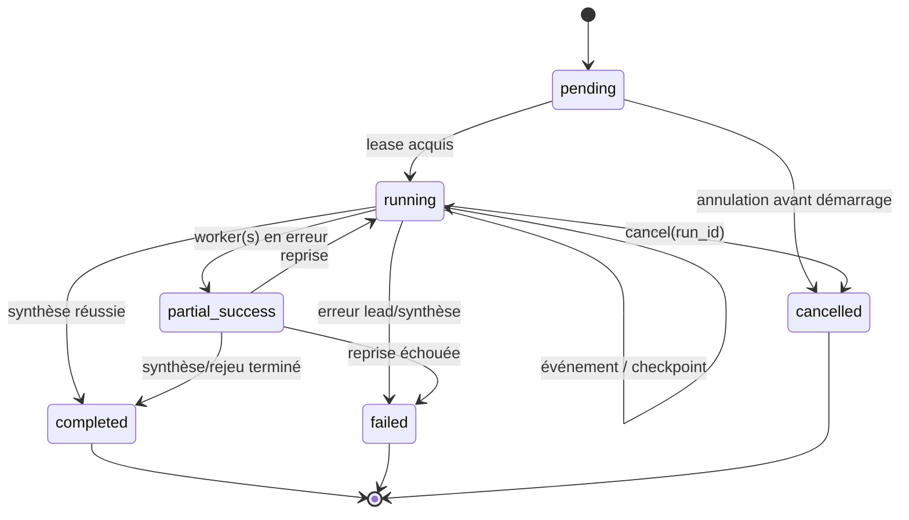

# Flux SSE MCP multi-agent

Ce document décrit le chemin réellement implémenté par ThinkTuning pour un
appel MCP `tools/call` du tool `orchestrate` en streaming. Le transport est
un `POST /mcp/sse` avec une requête JSON-RPC 2.0 et une réponse
`text/event-stream`.

## 1. Vue d'ensemble



Le flux est un aller-retour HTTP : il n'y a pas de connexion SSE `GET`
séparée. `Mcp-Session-Id` est transmis pour la traçabilité et l'évolution
future vers un transport stateful ; l'implémentation actuelle reste stateless.

## 2. Séquence détaillée

### 2.1 Requête initiale

Le dashboard (`McpSseClient.streamTool`) envoie :

```json
{
  "jsonrpc": "2.0",
  "id": 42,
  "method": "tools/call",
  "params": {
    "name": "orchestrate",
    "arguments": {
      "prompt": "Comparer les résultats des deux modèles",
      "mode": "multi_agent",
      "stream": true,
      "parallel": true,
      "event_granularity": "summary",
      "session_id": "conversation-123",
      "scope": "default"
    }
  }
}
```

En-têtes attendus :

| En-tête | Rôle |
|---|---|
| `Content-Type: application/json` | Corps JSON-RPC |
| `Accept: text/event-stream` | Réponse progressive |
| `X-API-Key` | Authentification fail-closed du transport |
| `X-Client-Id` | Identité d'audit, par défaut `thinktuning-dashboard` |
| `Mcp-Session-Id` | Corrélation de session MCP |

Le serveur refuse avant l'exécution : serveur désactivé (`503`), clé
invalide (`401`), JSON-RPC invalide (`-32600`/`-32602`), méthode inconnue
(`-32601`) ou tool hors scope.

### 2.2 Initialisation et policy

`MCPServer` résout le tool visible pour le rôle du client. `orchestrate` est
déclaré mutation et exige au minimum `contributor`. La visibilité du tool ne
désactive pas la policy AgentCore : chaque action interne est encore évaluée
par la sandbox et peut produire `awaiting_approval`.

Le run durable reçoit un `run_id`, un lease et un checkpoint initial. Les
événements sont normalisés avec `parent_task_id`, `phase`, `worker_id`,
`event_id`, `timestamp` et une séquence monotone quand ils sont persistés.

### 2.3 Orchestration

Le lead :

1. valide le prompt et le contexte d'exécution ;
2. produit le plan (`agent.plan`) ;
3. limite chaque worker au scope parent (`WorkerScopePolicy`) ;
4. exécute les workers en parallèle si `parallel=true` ;
5. collecte les résultats et lance la synthèse ;
6. termine par un statut `success`, `partial_success` ou `failed`.

Un repli explicite vers le mono-agent est signalé par
`orchestration_fallback`; il ne doit pas être interprété comme une réussite
multi-agent.

## 3. Événements SSE

Chaque événement est un bloc SSE terminé par une ligne vide :

```text
event: agent.worker.result
data: {"task_id":"w-1","status":"ok","summary":"..."}

```

### Événements de progression

| Événement | Phase | Payload utile |
|---|---|---|
| `orchestrate.started` / `orchestrate.start` | lead | `status`, `run_id` |
| `agent.resuming` | lead | `resume_request_id`, checkpoint |
| `agent.plan` | lead | `plan: [{task_id, role, subtask}]` |
| `agent.worker.start` | worker | `task_id`, `role`, `subtask`, `status=running` |
| `agent.worker.tool` | worker | tool et résumé de l'action |
| `agent.worker.thinking` | worker | fragment de réflexion |
| `agent.worker.result` | worker | `task_id`, `status=ok`, `summary`, `duration_ms` |
| `agent.worker.error` | worker | `task_id`, `status=error`, `message`, `error_code` |
| `agent.worker.approval` | worker | `request_id`, `approval`, `status=awaiting_approval` |
| `agent.synthesizing` / `orchestrate.synthesis` | synthesis | progression et résultats partiels |
| `agent.phase` | phase | `phase`, `status`, `reason`, `progress` |
| `agent.done` | synthesis | `answer` ou `final_answer`, statut final |
| `agent.error` | phase courante | `message`, `error_code`, phase |
| `checkpoint_recovered` | reprise | checkpoint et `retry_count` |
| `orchestration_fallback` | lead | `mode=mono_agent`, `reason`, `source` |

La granularité `minimal` conserve seulement début, fin, erreur et repli ;
`summary` conserve les transitions workers/synthèse ; `verbose` conserve les
événements détaillés, notamment thinking et outils. Le serveur applique ce
filtre avant l'émission SSE.

### Réponse finale et fin de flux

La réponse JSON-RPC finale est toujours compatible avec les clients MCP
génériques :

```text
event: message
data: {"jsonrpc":"2.0","id":42,"result":{"content":[{"type":"text","text":"{\"answer\":\"...\"}"}],"isError":false}}

data: [DONE]

```

Le client ThinkTuning consomme d'abord les événements nommés, puis décode
`event: message` comme résultat final. `[DONE]` arrête la lecture ; son
absence est une erreur de transport côté client.

## 4. Machine d'états durable



Checkpoints : `initialized`, `lead_planned`, `workers_running`,
`synthesis_running`, `completed`. Ils décrivent la reprise durable et ne
remplacent pas `resume_request_id`, qui reprend une demande d'approbation
AgentCore.

## 5. Approbation, annulation et reprise

- **Approbation** : `agent.worker.approval` expose `request_id` et le motif ;
  aucune mutation n'est exécutée automatiquement. Après décision humaine,
  le client relance avec `resume_request_id`.
- **Annulation** : le client annule la requête HTTP ; pour une reprise
  durable, `orchestrate_events`/lifecycle store utilise `run_id` et produit
  `run_cancelled`.
- **Reconnexion SSE** : appeler `orchestrate_events` avec `run_id` et
  `after_sequence`. Les événements persistés après ce curseur sont réémis
  sous `event: orchestrate.replay`. Un curseur invalide produit
  `event: replay.error`, puis `[DONE]`.
- **Flux interrompu** : les événements déjà reçus restent affichables ; le
  serveur émet une erreur synthétique si la réponse finale manque, au lieu de
  transformer des résultats partiels en succès.
- **Garantie du terminal** : `orchestrate.done` / `orchestrate.error` /
  `message` / `agent.done` / `agent.error` bypassent le filtre de granularité
  ET le flag `disconnected` — ils ne sont jamais abandonnés sur un
  `is_disconnected()` transitoire (proxy/onglet). La boucle SSE ne constate
  la déconnexion qu'après un timeout d'attente (heartbeat 10s), en drainant
  d'abord le terminal éventuellement déjà en file. Le `return` prématuré sur
  file vide pendant la synthèse est interdit : `orchestrate_stream` finalise
  toujours avant la sentinelle `None`.
- **Repli synthèse** : si le LLM de synthèse échoue (timeout/injoignable),
  `agent.done` porte quand même un `answer` reconstruit à partir des
  `shareable_summary` des workers (`Résultats partiels : …`), avec
  `failure_phase: synthesis` — jamais de bulle vide.

## 6. Projection frontend et observabilité

`orchestrateViaMcpStream` mappe les événements vers :

| Événements | Projection |
|---|---|
| `agent.plan` | `ChatMessageData.multiPlan` |
| `agent.worker.*` | `ChatMessageData.multiWorkers` |
| `agent.worker.thinking` / `orchestrate.thinking` | `thinking` |
| `agent.worker.tool` / `orchestrate.tool` | `toolCalls` |
| `orchestration_fallback` | `orchestrationNotice` |
| `event: message` | réponse finale et statut |

`MultiAgentTrace` affiche le plan, le statut de chaque worker et les
approbations sans exposer le raisonnement brut par défaut.

En parallèle, `mcp_flow` crée une session Flow Map pour `orchestrate` :
`mcp.orchestrate.start`, les événements d'outils/thinking, puis `mcp.done` ou
`mcp.error`. L'audit conserve le lien `client_id → tool → policy → run_id`
avec arguments sensibles hachés ou redigés.

## 7. Invariants à préserver

1. Ne jamais contourner `X-API-Key`, le scope MCP ou la sandbox AgentCore.
2. Ne jamais considérer un événement de progression comme la réponse JSON-RPC.
3. Toujours terminer un flux normal ou d'erreur par `data: [DONE]`.
4. Conserver l'ordre des séquences lors du replay.
5. Rendre les erreurs explicites (`replay.error`, `agent.error`,
   `orchestrate.error`) et conserver les résultats partiels.
6. Ne pas journaliser les secrets, clés API, prompts sensibles ou arguments
   mutation non redigés.

## Références d'implémentation

- [mcp_server_sse.py](../../backend/app/infrastructure/mcp/mcp_server_sse.py)
- [mcp_flow.py](../../backend/app/infrastructure/mcp/mcp_flow.py)
- [orchestrate_tool.py](../../backend/app/infrastructure/mcp/tools/orchestrate_tool.py)
- [mcp_ports.py](../../backend/app/domain/ports/mcp_ports.py)
- [mcpClient.ts](../../frontend/src/api/mcpClient.ts)
- [streamSse.ts](../../frontend/src/components/chat/streamSse.ts)
- [MultiAgentTrace.tsx](../../frontend/src/components/chat/MultiAgentTrace.tsx)
- [MCP_SECURITY.md](./MCP_SECURITY.md)
- [IMPLEMENTATION_PLAN.md](./IMPLEMENTATION_PLAN.md)
