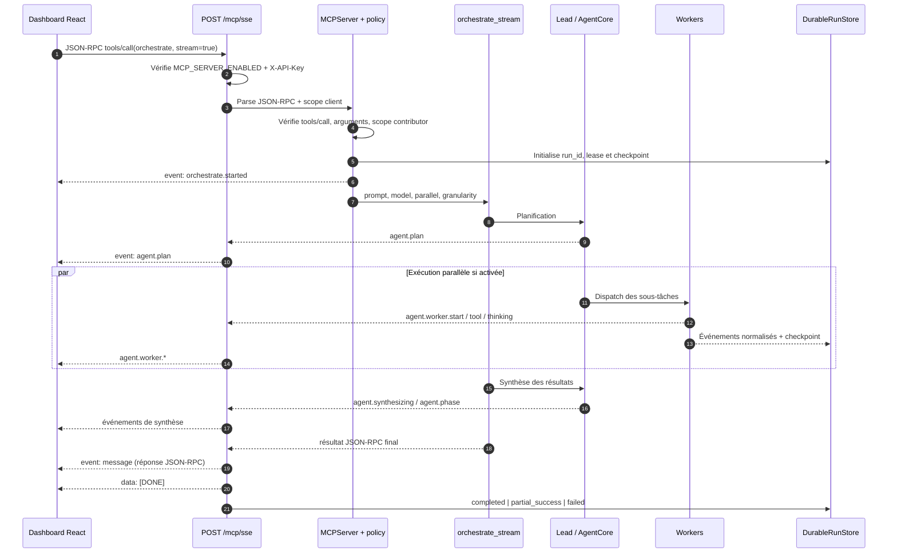
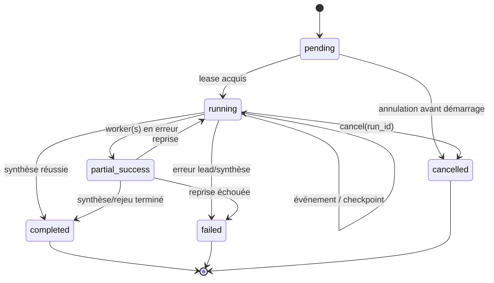

# Flux SSE MCP multi-agent

Ce document décrit le chemin réellement implémenté par ThinkTuning pour un
appel MCP `tools/call` du tool `orchestrate` en streaming. Le transport est
un `POST /mcp/sse` avec une requête JSON-RPC 2.0 et une réponse
`text/event-stream`.

## 1. Vue d'ensemble



Le flux est un aller-retour HTTP : il n'y a pas de connexion SSE `GET`
séparée. `Mcp-Session-Id` est transmis pour la traçabilité et l'évolution
future vers un transport stateful ; l'implémentation actuelle reste stateless.

## 2. Séquence détaillée

### 2.1 Requête initiale

Le dashboard (`McpSseClient.streamTool`) envoie :

```json
{
  "jsonrpc": "2.0",
  "id": 42,
  "method": "tools/call",
  "params": {
    "name": "orchestrate",
    "arguments": {
      "prompt": "Comparer les résultats des deux modèles",
      "mode": "multi_agent",
      "stream": true,
      "parallel": true,
      "event_granularity": "summary",
      "session_id": "conversation-123",
      "scope": "default"
    }
  }
}
```

En-têtes attendus :

| En-tête | Rôle |
|---|---|
| `Content-Type: application/json` | Corps JSON-RPC |
| `Accept: text/event-stream` | Réponse progressive |
| `X-API-Key` | Authentification fail-closed du transport |
| `X-Client-Id` | Identité d'audit, par défaut `thinktuning-dashboard` |
| `Mcp-Session-Id` | Corrélation de session MCP |

Le serveur refuse avant l'exécution : serveur désactivé (`503`), clé
invalide (`401`), JSON-RPC invalide (`-32600`/`-32602`), méthode inconnue
(`-32601`) ou tool hors scope.

### 2.2 Initialisation et policy

`MCPServer` résout le tool visible pour le rôle du client. `orchestrate` est
déclaré mutation et exige au minimum `contributor`. La visibilité du tool ne
désactive pas la policy AgentCore : chaque action interne est encore évaluée
par la sandbox et peut produire `awaiting_approval`.

Le run durable reçoit un `run_id`, un lease et un checkpoint initial. Les
événements sont normalisés avec `parent_task_id`, `phase`, `worker_id`,
`event_id`, `timestamp` et une séquence monotone quand ils sont persistés.

### 2.3 Orchestration

Le lead :

1. valide le prompt et le contexte d'exécution ;
2. produit le plan (`agent.plan`) ;
3. limite chaque worker au scope parent (`WorkerScopePolicy`) ;
4. dispatch les workers — **séquentiellement ou en parallèle selon `parallel`** ;
5. collecte les résultats et lance la synthèse ;
6. termine par un statut `success`, `partial_success` ou `failed`.

#### Argument `parallel` (L1 — SCRUM-152)

`parallel` a une **résolution en trois niveaux** (source unique :
`resolve_orchestration`, `app/infrastructure/mcp/tools/orchestrate_tool.py`) :

| Niveau | Source | Effet |
|---|---|---|
| 1 | `params.arguments.parallel` de la requête JSON-RPC | Décide seul (booléen accepté : `true/false`, `1/0`, `yes/no`, `on/off`) |
| 2 | `AGENT_MULTI_PARALLEL` (env) | Défaut opérationnel quand l'argument est ABSENT |
| 3 | `false` | Défaut du code si l'env n'est pas posée |

Points de contrat :

- l'absence de l'argument **conserve le défaut opérationnel** — elle ne
  désactive pas silencieusement le parallélisme ;
- la valeur résolue est **réellement transmise** à l'orchestrateur
  (`MultiAgentOrchestratorPort.run` / `run_streaming(parallel=…)`), donc
  observable dans la décision de dispatch — pas seulement journalisée ;
- `parallel` **n'affecte ni le budget ni le nombre de bulletins** : il ne change
  que l'ORDRE de dispatch des workers du même plan (les budgets `rounds` /
  `tool_calls` et la synthèse sont identiques) ;
- `parallel` **n'est pas un événement** : aucun `event:` ne le signale. La trace
  le prouve indirectement (ordre d'apparition des `agent.worker.start`).

Un repli explicite vers le mono-agent est signalé par
`orchestration_fallback` (payload `reason` + `source`, ex.
`multi_agent_disabled` / `worker_scope_violation`) ; il ne doit **pas** être
interprété comme une réussite multi-agent. Deux dégradations y ressemblent mais
sont distinctes : `orchestrate.degraded` (garantie relâchée — L2) et
`orchestration_fallback` (mode changé). Un repli ne produit jamais de `run_id`
multi-agent : le run durable n'existe qu'en mode `multi_agent`.

## 3. Événements SSE

Chaque événement est un bloc SSE terminé par une ligne vide :

```text
event: agent.worker.result
data: {"task_id":"w-1","status":"ok","summary":"..."}

```

### Événements de progression

Tous les événements ci-dessous sont filtrés par `event_granularity`
(`minimal` | `summary` | `verbose`) **sauf les terminaux** (voir plus bas).
La colonne « Phase » est la valeur normalisée portée par `payload.phase`
(vocabulaire fermé : `lead`, `worker`, `synthesis`, `orchestration`).

| Événement | Phase | Payload utile | Granularité minimale qui le conserve |
|---|---|---|---|
| `orchestrate.started` / `orchestrate.start` | `lead` | `status`, `mode`, `run_id`, `resumed`, `last_sequence` | `minimal` |
| `agent.plan` | `lead` | `plan: [{task_id, role, subtask}]` | `summary` |
| `agent.resuming` | `lead` | `resume_request_id`, checkpoint | `summary` |
| `checkpoint_recovered` | phase du run repris | `checkpoint`, `retry_count` | `summary` |
| `agent.worker.start` | `worker` | `task_id`, `worker_id`, `role`, `subtask`, `status=running` | `summary` |
| `agent.worker.tool` | `worker` | `tool` et résumé de l'action | `summary` |
| `agent.worker.thinking` | `worker` | fragment de réflexion | `summary` |
| `agent.worker.result` | `worker` | `task_id`, `status=ok`, `summary`, `duration_ms` | `summary` |
| `agent.worker.error` | `worker` | `task_id`, `status=error`, `message`, `error_code` | `summary` |
| `agent.worker.approval` | `worker` | `request_id`, `approval`, `status=awaiting_approval` | `summary` |
| `agent.worker.skipped` | `worker` | `worker_id`, `reason` (filtrage par politique d'intention) | `summary` |
| `agent.intent` | `lead` (défaut) | `intent` détectée globalement | `summary` |
| `agent.synthesizing` / `orchestrate.synthesis` | `synthesis` | progression et résultats partiels | `summary` |
| `agent.phase` | phase courante | `status`, `reason`, `payload` | `summary` |
| `orchestrate.thinking` | — (relais core, sans `phase`) | `thinking_delta` | `summary` |
| `orchestrate.tool` | — (relais core, sans `phase`) | `core_tool` + champs de l'événement core | `summary` |
| `orchestrate.worker` / `orchestrate.synthesis` | `worker` / `synthesis` | vue agrégée (1 événement par phase) | `summary` |
| `orchestrate.degraded` | phase courante | `reason`, `degraded: true`, `source` (L2) | `summary` |
| `orchestration_fallback` | `lead` | `mode=mono_agent`, `reason`, `source` | `minimal` |
| `run_cancelled` | phase courante | `reason` (annulation détachée) | `summary` |
| `agent.fallback` | `lead` | `reason` (repli conversationnel) | `summary` |

**Événements terminaux** — jamais filtrés, quelle que soit la granularité ni
l'état `disconnected` :

| Événement | Payload utile |
|---|---|
| `agent.done` | `answer` / `final_answer`, statut final, `failure_phase` |
| `agent.error` | `message`, `error_code`, `phase` |
| `orchestrate.done` | résultat JSON-RPC sérialisé (alias transport) |
| `orchestrate.error` | erreur JSON-RPC (`code`, `message`) ou erreur synthétique |
| `message` | réponse JSON-RPC finale (`result` ou `error`) — contrat client MCP générique |

**Événements d'erreur / de fin de flux (hors progression)** :

| Événement | Rôle |
|---|---|
| `replay_started` | début d'un flux `orchestrate_events` |
| `replay_completed` | fin d'un flux de replay + curseur final `last_sequence` |
| `replay.error` | `run_id` absent/invalide ou store illisible → puis `[DONE]` |
| `orchestrate.replay` | un événement durable rejoué (porte sa `sequence`) |
| `data: [DONE]` | sentinelle de fin — **tout** flux, normal ou en erreur |
| `: heartbeat` | commentaire de garde (~10 s) pendant l'attente du worker |

### Champ `sequence` (curseur durable — L1/L2)

Chaque événement durable persisté porte un champ **`sequence`** (entier,
monotone, attribué par le store). Les événements de progression relayés en SSE
l'exposent, ce qui donne au client un curseur sans requête supplémentaire :

| Observateur | Curseur obtenu | Autorité |
|---|---|---|
| Prélude `orchestrate.started` | `last_sequence` du run au moment du démarrage | Point de départ |
| Événement relayé | `sequence` du dernier événement vu | **Borne inférieure** (le client peut manquer les événements normalisés persistés après le terminal) |
| `replay_completed` | `last_sequence` | **Autoritative** |
| `orchestrate_get_run` | `last_sequence` | **Autoritative** |

Le curseur client est donc à traiter comme un **minimum sûr** : reprendre avec
`after_sequence = max(sequence vu, last_sequence reçu)` est correct, rejouer
légèrement plus que nécessaire est sans effet (les événements rejoués sont
postérieurs au curseur, jamais des doublons du flux déjà consommé).


### Normalisation des phases et du `worker_id` (L1 — SCRUM-152)

La hiérarchie durable `lead → worker → synthesis` est reconstruite de façon
**déterministe** par `normalize_mcp_event` (`app/domain/ports/mcp_ports.py`) :

| Cas | Règle appliquée |
|---|---|
| `phase` explicite ∈ {`lead`, `worker`, `synthesis`, `orchestration`} | Conservée telle quelle |
| Événement porteur d'un `worker_id` non nul | `phase = worker` (le worker ne disparaît plus de la hiérarchie) |
| Nom d'événement `orchestrate.worker*` / `agent.worker*` / `mcp.orchestrate.worker*` | `phase = worker` |
| Nom d'événement `orchestrate.synthesis*` / `agent.synthesis*` | `phase = synthesis` |
| `phase` inconnu (`dispatch`, `phase-1`…) | **Dérivé** du nom d'événement, plus écrasé par le défaut |
| Aucune information | `default_phase` de l'appelant (repli `lead`) |

`worker_id` est normalisé (chaîne nettoyée, `None` si vide) **sans jamais
écraser une valeur explicite**. Chaque événement normalisé reçoit aussi
`event_id`, `timestamp` et `parent_task_id` s'ils manquent.

Conséquences vérifiables :

- un `agent.worker.result` sans `phase` explicite n'est **plus** classé `lead` ;
- la phase est un **vocabulaire fermé** : une UI peut s'y fier sans `switch`
  défensif ;
- `failure_phase` (résultat final) est calculé à part, sur les mêmes
  conventions : `lead` (statut lead en échec), `worker` (workers en erreur),
  `synthesis` (synthèse en échec), sinon `None`.

### Dépréciation de `orchestrate.done` (L2 — SCRUM-153)

`orchestrate.done` est **déprécié comme canal de fin de run** mais reste
**émis et terminal** (compatibilité stricte des clients existants) :

| Statut | Détail |
|---|---|
| Émission | **Toujours émise** en fin de run (jamais supprimée) |
| Filtrage | Jamais filtrée (`TERMINAL_EVENT_KINDS`) quelle que soit la granularité |
| Statut | **Déprécié** — le contrat cible est `agent.done` + `event: message` |
| Remplacement | `event: message` (JSON-RPC) porte la réponse finale normative ; `agent.done` porte le payload métier (`answer` / `final_answer`, `failure_phase`) |
| Retrait | **Aucune date de retrait** planifiée : la fenêtre de compatibilité est ouverte (voir `PATTERN_ALIVEMCP.md` § Fenêtres de compatibilité) |
| Fenêtre | Maintenue tant qu'un client MCP tiers peut l'utiliser ; un retrait exigerait un bump majeur de `[tool.mcp].version` + RFC |

Un client cible doit donc lire la réponse finale depuis `event: message` (ou le
`result` JSON-RPC) et **ne jamais** dépendre du contenu de `orchestrate.done`.

### Prélude `orchestrate.started` (L1 — SCRUM-152)

Le prélude est émis **AVANT le premier octet utile** et porte le run durable
**PRÉPARÉ** (`prepare_run`) — pas encore exécuté :

- `run_id` : identifiant **DURABLE** du run (exposé dès l'ouverture du flux — le
  client peut tracer, annuler et reprendre sans attendre la réponse finale) ;
  `null` si le store durable est indisponible (le flux reste fonctionnel, mais
  ni replay ni annulation détachée ne sont possibles) ;
  **Correction L4 (SCRUM-155)** : `run_id` ≠ `resume_request_id` ≠ `task_id`
  (voir § « Découplage `run_id` / `resume_request_id` ») — un client ne doit
  jamais substituer un identifiant local à `run_id`, et un `run_id` `null`
  signifie « pas de reprise possible », pas « identifiant à générer » ;
- `resumed` : `true` uniquement pour une VRAIE reprise (run déjà engagé) ;
  un run fraîchement préparé est un DÉMARREMENT, pas une reprise (aucun
  `retry_count` consommé, aucun `checkpoint_recovered` fallacieux) ;
- `last_sequence` : curseur de replay mémorisé par le run — le client coupé
  reprend avec `after_sequence=last_sequence` sans rejouer l'historique.

Chaque événement de progression relayé porte en outre sa `sequence` durable
(attribuée par le store, mémorisée dans `last_sequence`) : le front peut ainsi
suivre son curseur sans requête supplémentaire.

La granularité `minimal` conserve seulement début, fin, erreur et repli ;
`summary` conserve les transitions workers/synthèse ; `verbose` conserve les
événements détaillés, notamment thinking et outils. Le serveur applique ce
filtre avant l'émission SSE.

### Réponse finale et fin de flux

La réponse JSON-RPC finale est toujours compatible avec les clients MCP
génériques :

```text
event: message
data: {"jsonrpc":"2.0","id":42,"result":{"content":[{"type":"text","text":"{\"answer\":\"...\"}"}],"isError":false}}

data: [DONE]

```

Le client ThinkTuning consomme d'abord les événements nommés, puis décode
`event: message` comme résultat final. `[DONE]` arrête la lecture ; son
absence est une erreur de transport côté client.

## 4. Machine d'états durable



Checkpoints : `initialized`, `lead_planned`, `workers_running`,
`synthesis_running`, `completed`. Ils décrivent la reprise durable et ne
remplacent pas `resume_request_id`, qui reprend une demande d'approbation
AgentCore. L1 (SCRUM-152) : la progression est MONOTONE — un checkpoint ne
régresse jamais (un événement worker tardif ne réécrit pas
`synthesis_running` en `workers_running`), et `last_sequence` suit la même
règle (max des séquences observées) pour que le replay reprenne exactement
après le dernier événement émis.

Transitions autorisées (source : `_MCP_RUN_TRANSITIONS`, `mcp_ports.py`) :

| État | Cibles autorisées |
|---|---|
| `pending` | `running`, `cancelled` |
| `running` | `running`, `awaiting_approval`, `partial_success`, `completed`, `failed`, `cancelled` |
| `awaiting_approval` | `running`, `awaiting_approval`, `partial_success`, `completed`, `failed`, `cancelled` |
| `partial_success` | `running`, `completed`, `failed`, `cancelled` |
| `completed` / `failed` / `cancelled` | ∅ (terminaux) |

`pending → failed` est **interdit** : un run jamais démarré est `cancelled`
(voir le sweeper, `PATTERN_ALIVEMCP.md`).

### Réconciliation de fond (L2 — SCRUM-153)

Un run dont le processus est mort entre deux transitions resterait non terminal
à jamais. Le sweeper (`app/infrastructure/mcp/run_sweeper.py`) :

| Situation | Action | Trace |
|---|---|---|
| `running` / `awaiting_approval` périmé | `transition → failed`, `last_error = stale_run_reaped` | Événement `orchestrate.degraded` (`reason: stale_run_reaped`) |
| `pending` périmé | `cancel` → `cancelled` | Événement `orchestrate.degraded` |
| Lease expiré | `release_lease` (réconciliation, **pas** un échec) | Métrique `mcp_runs_reconciled_total{action="lease_expired"}` |
| `partial_success` | **Jamais récolté** (aboutissement reprenable) | `skipped` |
| `awaiting_approval` | Grâce **plus longue** (attente humaine) | `skipped` jusqu'au seuil |

Si le lease expire pendant une exécution encore active, le sweeper peut le
libérer puis un autre worker peut reprendre le même `run_id` avant que
l'adaptateur ne termine son `finally`. Dans ce cas, la libération par
l'ancien propriétaire est un conflit de nettoyage attendu : l'adaptateur le
journalise et conserve le propriétaire repris. Ce conflit ne doit jamais
remplacer un résultat réussi ni masquer l'exception primaire de l'orchestrateur.

Variables : `MCP_RUN_SWEEPER_ENABLED`, `MCP_RUN_SWEEPER_INTERVAL_SECONDS`,
`MCP_RUN_STALE_AFTER_SECONDS`, `MCP_RUN_AWAITING_APPROVAL_GRACE_SECONDS`.
Une passe ne lève JAMAIS (store indisponible → `errors` incrémenté, cycle
suivant).

## 5. Découplage `run_id` / `resume_request_id`

**Correction majeure L4 (SCRUM-155)** : le transport manipule **trois**
identifiants distincts, souvent confondus dans la documentation antérieure.

| Identifiant | Nature | Portée | Cycle de vie | Persisté dans |
|---|---|---|---|---|
| `run_id` | Run **durable** multi-agent | Store durable (SQLite/Mongo) | Stable d'une reprise à l'autre ; terminal → plus reprenable | `mcp_durable_runs` (état + `last_sequence` + lease) |
| `resume_request_id` | Demande d'**approbation** AgentCore | Table `approvals` | Consommé par la reprise d'une action approuvée (`resolve_resume_hash`) | `approvals` |
| `task_id` | Sous-tâche / worker ciblé | Déclaratif (re-dispatch ciblé) | Vit le temps d'un worker | Payload d'événement |

Règles opposables :

1. `run_id` **ne dépend jamais** de la validation humaine : un run suspendu en
   `awaiting_approval` conserve le MÊME `run_id` après approbation ;
2. `resume_request_id` **n'est pas** un identifiant de run — l'utiliser comme
   `run_id` produit une erreur `-32602` (« run durable inconnu ») ;
3. `run_id` est validé AVANT exécution : un `run_id` inconnu ou terminal →
   `orchestrate.error` (code `-32602`) avant toute action ;
4. la reprise ciblée passe `run_id` **et** `resume_request_id` **et**
   optionnellement `task_id` : l'orchestrateur re-dispatch le seul worker dont
   le `request_id` est repris ;
5. `resumed: true` dans `orchestrate.started` signifie « run durable déjà
   engagé », jamais « `resume_request_id` fourni » ;
6. un repli mono-agent ne produit **jamais** de `run_id` : le run durable n'existe
   qu'en mode `multi_agent`.

### Exemple de reprise ciblée

```json
{
  "jsonrpc": "2.0",
  "id": 44,
  "method": "tools/call",
  "params": {
    "name": "orchestrate",
    "arguments": {
      "prompt": "Comparer les résultats des deux modèles",
      "mode": "multi_agent",
      "stream": true,
      "run_id": "20539535414d",
      "resume_request_id": "req-approval-789",
      "task_id": "w-2"
    }
  }
}
```

L'événement `agent.resuming` porte `resume_request_id` (l'approbation reprise),
tandis que `orchestrate.started` porte `run_id` avec `resumed: true`.

## 6. Contrat de STREAM

Le contrat de stream lie le transport (`POST /mcp/sse`,
`tools/call orchestrate`, `stream: true`) au client.

### Séquence normative

```text
1. orchestrate.started                        (prélude, non terminal)
2. trace* : agent.plan / agent.worker.* / agent.synthesizing / orchestrate.*
3. terminal : agent.done | orchestrate.done | agent.error | orchestrate.error
4. event: message                             (réponse JSON-RPC)
5. data: [DONE]                               (sentinelle)
```

### Garanties

| # | Garantie | Preuve |
|---|---|---|
| S1 | Le prélude `orchestrate.started` précède tout autre événement | `orchestrate_stream` (émission avant la boucle) |
| S2 | Les progressions portent `phase`, `worker_id` et `sequence` | `normalize_mcp_event` |
| S3 | Un événement de progression n'est **jamais** la réponse JSON-RPC | §11 invariant 2 |
| S4 | Le filtre de granularité ne s'applique **jamais** aux terminaux | `mcp_events.event_allowed` |
| S5 | Un `is_disconnected()` transitoire n'abandonne pas le terminal | `_TERMINAL_SSE_KINDS` + drain au heartbeat |
| S6 | Sans terminal, `orchestrate.error` + `message` **synthétiques** sont émis (`isError: true`, `reason: orchestration_stream_interrupted`) | Fin de `orchestrate_stream` |
| S7 | Tout flux se termine par `data: [DONE]` (normal **ou** en erreur) | Contrat transport |
| S8 | Le repli mono-agent est signalé (`orchestration_fallback`) sans `run_id` | `resolve_orchestration` |

### Exemple exécutable

`backend/scripts/example_mcp_stream_replay.py` imprime les trames SSE réelles
(sections 1 à 4) puis vérifie les invariants par assertions — aucune
dépendance réseau, LLM ou base externe.

## 7. Contrat de REPLAY

Le replay lie `tools/call orchestrate_events` au run durable.

### Requête

```json
{
  "jsonrpc": "2.0",
  "id": 43,
  "method": "tools/call",
  "params": {
    "name": "orchestrate_events",
    "arguments": {
      "run_id": "20539535414d",
      "after_sequence": 2,
      "replay": true,
      "stream": true
    }
  }
}
```

### Séquence normative

```text
1. replay_started   { run_id, after_sequence }
2. orchestrate.replay × N   (événements persistés de sequence > after_sequence)
3. replay_completed { run_id, last_sequence }
4. data: [DONE]
```

En cas d'erreur : `replay.error { run_id, error }` puis `data: [DONE]` — la
sentinelle est émise dans **tous** les cas.

### Garanties

| # | Garantie | Détail |
|---|---|---|
| R1 | `run_id` **obligatoire** | Absent/vide → `replay.error`, puis `[DONE]` |
| R2 | `after_sequence` borné | Coercition `max(0, floor(n))` |
| R3 | Réémission **strictement postérieure** au curseur | `list_events_after(run_id, after_sequence)` |
| R4 | Ordre des séquences **conservé** | `sequence` croissante |
| R5 | `replay_completed.last_sequence` = dernière séquence réémise, sinon `after_sequence` | Curseur suivant |
| R6 | Un store illisible n'échoue **pas** silencieusement | `replay.error` + log d'exception |
| R7 | Replay **idempotent** : rejouer depuis un curseur déjà dépassé renvoie 0 événement | Conséquence de R3 |
| R8 | Un replay peut inclure des événements normalisés post-terminal (`orchestrate.lead` / `.worker` / `.synthesis`) — le curseur d'un client encore en stream peut donc être **inférieur** au `last_sequence` durable | `MultiAgentMCPAdapter.run` |

### Différence stream ↔ replay

| Critère | Stream (tour initial) | Replay (reprise) |
|---|---|---|
| Tool | `orchestrate` | `orchestrate_events` |
| Déclencheur | Nouveau tour / reprise volontaire | Coupure réseau, onglet fermé, proxy |
| Coût LLM | Oui | **Non** (lecture du store) |
| Effet de bord | Exécution d'outils | **Aucun** |
| Curseur d'entrée | Aucun (ou `run_id` repris) | `after_sequence` requis |
| Curseur de sortie | `sequence` des trames (borne inférieure) + `last_sequence` | `replay_completed.last_sequence` (**autoritative**) |
| Terminal | `agent.done` / `message` | `replay_completed` |

### Exemple exécutable

La section 3 de `backend/scripts/example_mcp_stream_replay.py` simule une
coupure au curseur `2`, rejoue les événements postérieurs, puis vérifie
`sequence > after_sequence` sur **chaque** événement rejoué.

## 8. Approbation, annulation et reprise

- **Approbation** : `agent.worker.approval` expose `request_id` et le motif ;
  aucune mutation n'est exécutée automatiquement. Le run passe en
  `awaiting_approval` (état **non terminal**, reprenable). Après décision
  humaine, le client relance avec **le même `run_id`** ET `resume_request_id`
  (voir §5).
- **Annulation** : le client annule la requête HTTP (bouton Stop) ; le
  transport SSE annule alors le run durable de façon détachée
  (`port.cancel(run_id, reason="client disconnected")` →
  `transition → cancelled`, `last_error = "client disconnected"`, événement
  `run_cancelled` persisté et émis) — sans cela le run restait `running` à
  jamais (run zombie non repris, lease jamais libéré).
  - L'annulation s'applique aussi à un Stop survenant **dès le prélude**
    `orchestrate.started` (le `yield` du prélude est protégé par un
    `except (asyncio.CancelledError, GeneratorExit)` qui annule le run) ;
  - elle est **idempotente** : un run déjà terminal n'est pas re-transitionné ;
  - elle ne s'applique **jamais** à un run dont la réponse finale a déjà été
    émise (`final_emitted`) — un run `completed` reste `completed` ;
  - **Correction L4** : l'annulation est un acte **par requête HTTP**, pas un
    état partagé. Deux onglets sur le même `run_id` sont un cas non supporté
    (un second `orchestrate` sur un `run_id` terminal est refusé avec
    `-32602`) — il n'existe pas d'« annulation collaborative » ;
  - une annulation d'un run **`awaiting_approval`** le fait passer en
    `cancelled` : l'approbation n'est jamais rejouée après coup.
- **Reconnexion SSE** : appeler `orchestrate_events` avec `run_id` et
  `after_sequence` (voir §7). Un curseur invalide produit
  `event: replay.error`, puis `[DONE]`.
- **Flux interrompu** : les événements déjà reçus restent affichables ; le
  serveur émet une erreur synthétique si la réponse finale manque, au lieu de
  transformer des résultats partiels en succès. Le run durable est alors
  annulé (`orchestration_stream_interrupted`) pour ne pas rester orphelin.
- **Garantie du terminal** : `orchestrate.done` / `orchestrate.error` /
  `message` / `agent.done` / `agent.error` bypassent le filtre de granularité
  ET le flag `disconnected` — ils ne sont jamais abandonnés sur un
  `is_disconnected()` transitoire (proxy/onglet). La boucle SSE ne constate
  la déconnexion qu'après un timeout d'attente (heartbeat 10s), en drainant
  d'abord le terminal éventuellement déjà en file. Le `return` prématuré sur
  file vide pendant la synthèse est interdit : `orchestrate_stream` finalise
  toujours avant la sentinelle `None`.
- **Repli synthèse** : si le LLM de synthèse échoue (timeout/injoignable),
  `agent.done` porte quand même un `answer` reconstruit à partir des
  `shareable_summary` des workers (`Résultats partiels : …`), avec
  `failure_phase: synthesis` — jamais de bulle vide.

## 9. Résilience de la surface MCP (L2 — SCRUM-153)

Ces garanties s'appliquent **avant** l'exécution (admission) et **pendant**
(observabilité). Détail des patterns : `PATTERN_ALIVEMCP.md`.

| Mécanisme | Contrat | Réglage |
|---|---|---|
| Backpressure globale | `503` + `Retry-After` + `error.code = mcp_backpressure` | `MCP_MAX_CONCURRENT_STREAMS` (défaut 32) |
| Backpressure par client | `503` + `Retry-After` (équité entre clients) | `MCP_MAX_CONCURRENT_STREAMS_PER_CLIENT` (défaut 4) |
| Quota d'ouverture | `429` + `Retry-After` + `error.code = mcp_sse_quota_exceeded` | `MCP_SSE_OPEN_RATE_PER_MINUTE` (défaut 30) |
| Idempotence | En-tête `Idempotency-Key` **prioritaire** sur `params.arguments.idempotency_key` ; `replay` rejoue sans réexécuter, `inflight` refuse le doublon, `conflict` sur empreinte divergente | `DEFAULT_TTL_SECONDS`, `DEFAULT_IN_FLIGHT_TTL_SECONDS` |
| Dégradation explicite | `result._meta` **toujours** présent : `degraded`, `run_id`, `reason`, `failure_phase` | Vocabulaire fermé (`VALID_DEGRADATION_REASONS`) |
| Idempotence du fingerprint | L'empreinte **exclut** la clé d'idempotence (métadonnée de transport) : un réessai qui déplace la clé en-tête ↔ corps n'est pas un conflit | `fingerprint_payload` |

Métriques exposées (`GET /metrics`), toutes à **labels bornés** (jamais de
`client_id`) :

| Métrique | Type | Usage |
|---|---|---|
| `mcp_runs_total{status}` | Counter | Issue des runs durables |
| `mcp_runs_degraded_total{reason}` | Counter | Dégradations explicites |
| `mcp_runs_active` | Gauge | Runs non terminaux observés |
| `mcp_runs_reconciled_total{action}` | Counter | Réconciliations du sweeper |
| `mcp_sse_streams_active` | Gauge | Flux SSE ouverts (global) |
| `mcp_backpressure_rejections_total{scope}` | Counter | Rejets `503` par portée (`global`/`client`/`quota`) |
| `mcp_sse_quota_rejections_total{reason}` | Counter | Rejets `429` |
| `mcp_sse_interrupted_total{reason}` | Counter | Flux interrompus sans terminal |
| `mcp_security_rejections_total{reason}` | Counter | Refus de sécurité |
| `mcp_idempotency_total{outcome}` | Counter | `new`/`replay`/`inflight`/`conflict` |

## 10. Projection frontend et observabilité

`orchestrateViaMcpStream` mappe les événements vers :

| Événements | Projection |
|---|---|
| `orchestrate.started` | `started` (curseur `run_id` / `resumed` / `last_sequence`) |
| `agent.plan` | `ChatMessageData.multiPlan` |
| `agent.worker.*` | `ChatMessageData.multiWorkers` |
| `agent.worker.thinking` / `orchestrate.thinking` | `thinking` |
| `agent.worker.tool` / `orchestrate.tool` | `toolCalls` |
| `orchestration_fallback` | `orchestrationNotice` |
| `event: message` | réponse finale et statut |

L1 (SCRUM-152) : le client mémorise le curseur de reprise exposé par
`orchestrate.started` (via l'event `started` de `orchestrateViaMcpStream`),
puis rejoue les événements manquants après une coupure avec
`replayOrchestrateEvents(runId, lastSequence, onEvent)` — le tool
`orchestrate_events` réémet les événements persistés après le curseur
(`orchestrate.replay`) et retourne le NOUVEAU curseur pour le replay suivant.

`MultiAgentTrace` affiche le plan, le statut de chaque worker et les
approbations sans exposer le raisonnement brut par défaut.

En parallèle, `mcp_flow` crée une session Flow Map pour `orchestrate` :
`mcp.orchestrate.start`, les événements d'outils/thinking, puis `mcp.done` ou
`mcp.error`. L'audit conserve le lien `client_id → tool → policy → run_id`
avec arguments sensibles hachés ou redigés.

## 11. Invariants à préserver

1. Ne jamais contourner `X-API-Key`, le scope MCP ou la sandbox AgentCore.
2. Ne jamais considérer un événement de progression comme la réponse JSON-RPC.
3. Toujours terminer un flux normal ou d'erreur par `data: [DONE]`.
4. Conserver l'ordre des séquences lors du replay.
5. Rendre les erreurs explicites (`replay.error`, `agent.error`,
   `orchestrate.error`) et conserver les résultats partiels.
6. Ne pas journaliser les secrets, clés API, prompts sensibles ou arguments
   mutation non redigés.
7. **L4** — Ne jamais confondre `run_id` (run durable) et `resume_request_id`
   (approbation) ; le premier seul autorise replay et annulation.
8. **L4** — Un événement terminal n'est jamais filtré, jamais abandonné, et
   survit à un `is_disconnected()` transitoire.
9. **L4** — Toute dégradation est **explicite** (`_meta.degraded` + `reason`),
   jamais silencieuse : un client doit pouvoir la détecter sans deviner.
10. **L4** — Un refus d'admission est un **contrat HTTP** (`503`/`429` +
    `Retry-After` + `error.code`), jamais une file d'attente silencieuse.
11. **L4** — Le replay est **sans effet de bord** et **sans coût LLM** :
    réexécuter un run via `orchestrate_events` est impossible par construction.
12. **L4** — Les labels de métriques restent **bornés** : aucun identifiant
    client, run ou requête arbitraire n'entre dans un label.

## Références d'implémentation

- [mcp_server_sse.py](../../backend/app/infrastructure/mcp/mcp_server_sse.py)
- [mcp_events.py](../../backend/app/infrastructure/mcp/mcp_events.py) — politique d'événements (source unique)
- [backpressure.py](../../backend/app/infrastructure/mcp/backpressure.py) — admission bornée
- [idempotency.py](../../backend/app/infrastructure/mcp/idempotency.py) — `Idempotency-Key`
- [mcp_metrics.py](../../backend/app/infrastructure/mcp/mcp_metrics.py) — métriques bornées
- [run_sweeper.py](../../backend/app/infrastructure/mcp/run_sweeper.py) — réconciliation des runs zombies
- [mcp_flow.py](../../backend/app/infrastructure/mcp/mcp_flow.py)
- [orchestrate_tool.py](../../backend/app/infrastructure/mcp/tools/orchestrate_tool.py)
- [mcp_orchestration.py](../../backend/app/application/mcp_orchestration.py) — `prepare_run` / `get_run` / `get_events`
- [mcp_ports.py](../../backend/app/domain/ports/mcp_ports.py) — FSM durable + normalisation
- [mcpClient.ts](../../frontend/src/api/mcpClient.ts)
- [streamSse.ts](../../frontend/src/components/chat/streamSse.ts)
- [MultiAgentTrace.tsx](../../frontend/src/components/chat/MultiAgentTrace.tsx)
- [example_mcp_stream_replay.py](../../backend/scripts/example_mcp_stream_replay.py) — exemple exécutable des contrats stream + replay
- [test_mcp_resilience.py](../../backend/tests/test_mcp_resilience.py) — preuves des patterns de résilience
- [PATTERN_ALIVEMCP.md](./PATTERN_ALIVEMCP.md) — tableau pattern/preuve/test
- [MCP_SECURITY.md](./MCP_SECURITY.md)
- [CHANGELOG.md](./CHANGELOG.md)
- [IMPLEMENTATION_PLAN.md](./IMPLEMENTATION_PLAN.md)
